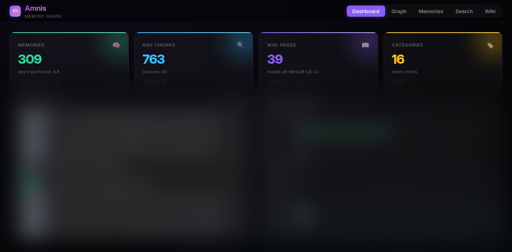
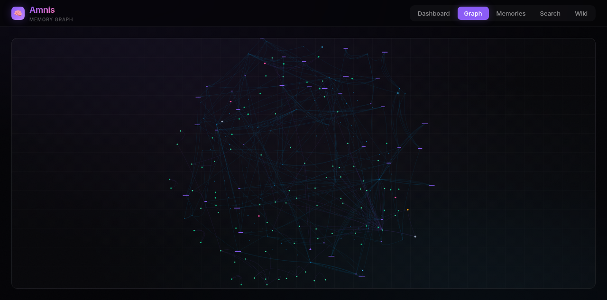

# Amnis ☀️

**Persistent Memory + RAG + Wiki Compilation for AI Agents**

Amnis is a three-layer memory system that gives AI agents long-term, structured knowledge across sessions. It plugs into any MCP-compatible client (Hermes, Claude, etc.) and provides a self-hosted web dashboard for visualization.

---

## Why Amnis?

LLMs are stateless. Every conversation starts from zero. Amnis fixes that by adding:

| Layer | Purpose | Backend |
|-------|---------|---------|
| **Memory Store** | Persistent facts, preferences, events with categories, importance, tags | SQLite |
| **RAG Engine** | Hybrid search over local documents (Obsidian vault, PDFs, code, notes) | ChromaDB + sentence-transformers + FTS5 |
| **Wiki Compiler** | Karpathy-style structured knowledge pages auto-generated from all sources | Markdown + cross-refs |

Together, these create a **personal knowledge graph** that grows smarter over time.

---

## Features

- **Hybrid RAG search** — Reciprocal Rank Fusion (RRF) blending semantic (ChromaDB) + keyword (FTS5) results for precision
- **Heading-aware chunking** — Respects H1–H6 boundaries so sections stay intact
- **Episodic memory** — Chronological event log with auto-pruning, outcome tracking, and per-episode importance
- **Reflection hierarchy** — Observations auto-clustered into mid-level themes (Stanford Generative Agents paper)
- **Working memory** — In-memory ring buffer for agent scratchpad, with JSON persistence and episodic flush
- **Pruning pipeline** — Low-importance, stale, and near-duplicate fact cleanup with confidence decay (0.98^days)
- **Contradiction detection** — Polarity-based flagging of conflicting facts
- **Semantic dedup** — Cosine-similarity merging of near-identical memories
- **Web UI** — Dashboard, interactive knowledge graph, memory browser, wiki viewer
- **MCP server** — 18+ tools for agent integration

---

## Research Foundation

Amnis is built on published research across cognitive architectures, generative agents, information retrieval, and episodic memory. Every layer maps to a specific paper or finding.

### CoALA Framework (Princeton 2023)

The [Cognitive Architectures for Language Agents](https://arxiv.org/abs/2309.02427) paper defines four memory types for AI agents. Amnis implements all four as concrete backends:

| CoALA Memory Type | Amnis Implementation | Backend |
|---|---|---|
| **Working Memory** — agent's scratchpad for current context | `amnis/memory/working.py` — ring buffer with push/get/pop/clear, JSON persistence, automatic eviction at 20 slots, `flush_to_episodic()` for persisting transient context | In-memory + JSON file |
| **Episodic Memory** — autobiographical recall of past interactions | `amnis/memory/episodic.py` — timestamped event log with outcome tracking (success/failure/neutral), structured results, session-scoped queries, auto-pruning | SQLite (`conversation_logs`) |
| **Semantic Memory** — facts, preferences, domain knowledge | `amnis/memory/store.py` + `amnis/rag/engine.py` — categorized facts with importance scoring (1–10), confidence tracking, tags, hybrid RAG search using Reciprocal Rank Fusion | SQLite (`memory_facts`) + ChromaDB + FTS5 |
| **Procedural Memory** — how to act, workflows, tool selection | Wiki Compiler (`amnis/wiki/compiler.py`) — auto-generated structured knowledge pages cross-referenced across all three layers | Markdown wiki |

### Generative Agents (Stanford 2023)

The Stanford paper on [Generative Agents: Interactive Simulacra of Human Behavior](https://arxiv.org/abs/2304.03442) found that **removing reflection broke emergent behaviors** — agents stopped forming high-level beliefs from raw observations. Amnis implements a reflection hierarchy in `amnis/memory/consolidation.py`:

```
Raw observations → Embedding clustering (cosine >0.75) → Theme synthesis → Stored as `theme` facts
```

- Up to 5 theme clusters per consolidation run
- Existing themes are reinforced (confidence +0.05, importance +1) rather than duplicated
- Themes carry cross-references to source observations for full traceability

### Episodic Memory (arXiv 2024)

The [Episodic Memory is the Missing Piece for Long-Term LLM Agents](https://arxiv.org/abs/2502.06975) paper identifies five required properties for episodic memory. Amnis meets all five:

| Property | Amnis Implementation |
|---|---|
| Long-term storage | SQLite persistence across sessions with configurable retention (default 180 days) |
| Explicit reasoning | `amnis_episodic_recall` MCP tool returns structured episodes with summaries, topics, and outcome |
| Single-shot learning | Each `log_episode()` call encodes a unique experience from one exposure |
| Instance-specific content | Every episode captures full role + content + timestamp + outcome |
| Contextual relations | Episodes are bound to `session_id`, ranked by importance, filterable by outcome |

### Hybrid Search with RRF

Amnis uses **Reciprocal Rank Fusion** (k=60) to blend semantic search (ChromaDB cosine similarity) with keyword search (SQLite FTS5 full-text search). This technique, widely cited in the RAG literature, ensures chunks must rank well in **both** methods to score highly:

```
rrf_score(chunk) = 1/(60 + rank_semantic) + 1/(60 + rank_keyword)
```

Combined with **heading-aware chunking** (respects H1–H6 boundaries, configurable via `chunk_size`/`chunk_overlap`/`heading_level`), this preserves document structure during ingestion — sections stay intact rather than being split mid-paragraph.

### Memory Consolidation Pipeline

Inspired by the Mem0/Letta agent memory frameworks and the Generative Agents consolidation process, Amnis runs a background pipeline at `amnis/memory/consolidation.py`:

1. **Extract** — scan recent conversation logs, extract structured `MemoryFact` records with computed importance scores
2. **Contradiction detection** — polarity scoring flags facts with opposite sentiment on the same topic, confidence is reduced on both
3. **Semantic dedup** — cosine similarity >0.9 merges near-identical facts (longer/more specific version wins)
4. **Reflect** — cluster observations into theme-level beliefs (Stanford finding)
5. **Prune** — decay confidence by 0.98^days since last access, remove stale/low-importance/near-duplicate facts at `amnis/memory/pruning.py`

### Disk Impact

All of this runs in **~5.9 MB** for a typical setup (242 memories + 425 RAG chunks + 32 wiki pages). Zero new dependencies beyond ChromaDB, sentence-transformers, and SQLite.

```
Memory facts (SQLite)      ~100 KB / 1,000 facts
Episodic logs (SQLite)      ~50 KB / 1,000 episodes
ChromaDB vectors           ~2 MB / 500 chunks
FTS5 keyword index         ~1 MB / 500 chunks
Wiki pages (markdown)     ~200 KB / 50 pages
```

---

## Architecture

```
┌─────────────────────────────────────────────────────────────┐
│                      Amnis Core                              │
│  ┌──────────────┐  ┌──────────────┐  ┌──────────────────┐   │
│  │   Memory     │  │    RAG       │  │     Wiki         │   │
│  │   Store      │  │   Engine     │  │   Compiler       │   │
│  │  (SQLite)    │  │ (ChromaDB    │  │   (Markdown)     │   │
│  │              │  │  + FTS5)     │  │                  │   │
│  └──────┬───────┘  └──────┬───────┘  └────────┬─────────┘   │
│         │                 │                   │              │
└─────────┼─────────────────┼───────────────────┼──────────────┘
          │                 │                   │
          ▼                 ▼                   ▼
┌─────────────────────────────────────────────────────────────┐
│                    MCP Server (stdio)                        │
│  18+ tools: remember, recall, forget, search, hybrid-search,│
│  episodic-log, episodic-recall, prune, consolidate,         │
│  compile-wiki, wiki_query, status, ...                      │
└─────────────────────────────────────────────────────────────┘
                              ▲
                              │ MCP / HTTP
              ┌───────────────┼───────────────┐
              ▼               ▼               ▼
       ┌──────────┐    ┌───────────┐   ┌──────────┐
       │  Hermes  │    │  Web UI   │   │  Other   │
       │  Agent   │    │ (port     │   │  MCP     │
       │          │    │  8799)    │   │  Clients │
       └──────────┘    └───────────┘   └──────────┘
```

---

## Quick Start

### Prerequisites
- Python 3.11+
- ~2GB RAM for embedding model (all-MiniLM-L6-v2, 33MB)

### Install

```bash
# Clone
git clone https://github.com/mandoof1/amnis.git
cd amnis

# Create venv & install
python3 -m venv .venv
source .venv/bin/activate
pip install -e .

# Or minimal manual install:
# pip install chromadb mcp fastapi pydantic-settings sqlalchemy sentence-transformers uvicorn
```

### Initialize & Run

```bash
# Initialize directories and index your vault
python -m amnis init

# Check system status
python -m amnis status

# Start MCP server (for Hermes/Claude)
python -m amnis server

# Start Web UI in background
python -m amnis web
# → http://127.0.0.1:8799/
```

---

## CLI Commands

| Command | Description |
|---------|-------------|
| `init` | Create data dirs, index vault, compile wiki |
| `server` | Run MCP stdio server (default) |
| `web` | Run FastAPI web UI on port 8799 |
| `remember "fact" [--category X] [--importance N] [--tags a,b]` | Store a memory |
| `recall "query" [--category X] [--limit N]` | Retrieve memories |
| `forget <memory_id>` | Delete a memory |
| `search "query" [--limit N]` | Semantic search vault |
| `hybrid-search "query" [--limit N]` | RRF hybrid search (semantic + keyword) |
| `index <file_path>` | Index a single document |
| `index-vault` | Re-index entire Obsidian vault |
| `compile-wiki [topic ...]` | Build wiki pages |
| `episodic-log <session> <role> <content>` | Log a conversation turn |
| `episodic-recall <session> [--limit N]` | Retrieve episode history |
| `prune` | Run memory cleanup (stale, low-importance, duplicates) |
| `status` | Show memory/RAG/wiki stats |

---

## MCP Tools (for Hermes, Claude, etc.)

Configure in your client's `config.yaml`:

```yaml
mcp_servers:
  amnis:
    command: /path/to/amnis/.venv/bin/python
    args: ["-m", "amnis.server.mcp"]
```

### Memory Tools

| Tool | Description |
|------|-------------|
| `amnis_remember` | Store a fact with category, importance (1-10), tags |
| `amnis_recall` | Query memories by text, category, importance |
| `amnis_forget` | Delete memory by ID |
| `amnis_memory_stats` | Total memories, by category, avg importance |
| `amnis_consolidate` | Extract new facts from conversation logs + reflection |
| `amnis_prune_memory` | Run cleanup pipeline (decay, stale, duplicates) |

### Search Tools

| Tool | Description |
|------|-------------|
| `amnis_search` | Semantic search over indexed documents (with optional metadata filter) |
| `amnis_hybrid_search` | RRF hybrid search — semantic + FTS5 with metadata filter |
| `amnis_index_file` | Add a file to the vector store |
| `amnis_index_vault` | Full vault re-index |
| `amnis_rag_stats` | Chunk count, unique sources, embedding model |

### Episodic Tools

| Tool | Description |
|------|-------------|
| `amnis_episodic_log` | Log a conversation episode (optionally with outcome + results) |
| `amnis_episodic_recall` | Retrieve recent episodes for a session |

### Wiki Tools

| Tool | Description |
|------|-------------|
| `amnis_compile_wiki` | Build wiki from all knowledge layers |
| `amnis_wiki_query` | Ask wiki a natural language question |
| `amnis_wiki_lint` | Find stale pages, missing sources, broken refs |
| `amnis_wiki_stats` | Page count, source count, wiki directory |

### System Tools

| Tool | Description |
|------|-------------|
| `amnis_status` | Full system health check |
| `amnis_amnis_remember` | Alias for amnis_remember |

---

## Web UI

```
http://127.0.0.1:8799/
```

**Five tabs:**

- **📊 Dashboard** — System stats, recent memories, category distribution
- **🕸️ Graph** — Interactive vis.js knowledge graph (memories, wiki pages, documents as nodes; keyword/source edges)
- **🧠 Memories** — Browse, search, filter, create memories with inline forms
- **🔍 Search** — RAG hybrid search over vault with relevance scores
- **📝 Wiki** — Sidebar navigation + rendered markdown content viewer

![Dark theme, responsive, works on mobile]

---

## Data Layout

```
~/amnis/                    # or $AMNIS_DATA_DIR
├── data/
│   ├── memory.db           # SQLite: facts, prefs, events, episodes
│   ├── chroma/             # ChromaDB vector embeddings
│   └── wiki/               # Compiled .md wiki pages
├── .venv/                  # Python environment
└── config.yaml             # Optional: override paths, model, ports
```

All data is **local-first**. Nothing leaves your machine.

---

## Configuration

Environment variables (all optional):

```bash
export AMNIS_DATA_DIR=~/custom/amnis/data
export AMNIS_VAULT_PATH=~/Documents/MyVault
export AMNIS_EMBEDDING_MODEL=all-MiniLM-L6-v2
export AMNIS_HOST=127.0.0.1
export AMNIS_PORT=8799
export AMNIS_CHUNK_SIZE=500
export AMNIS_CHUNK_OVERLAP=50
export AMNIS_HYBRID_WEIGHT=0.5
```

Or create `config.yaml` in the data directory (see `amnis/config.py` for schema).

---

## Systemd Service (Auto-start on Linux)

```bash
# Copy and enable
cp amnis-web.service ~/.config/systemd/user/
systemctl --user daemon-reload
systemctl --user enable --now amnis-web

# Check status
systemctl --user status amnis-web
```

The service uses `%h` (home dir) so it works for any user.

---

## Example Workflow

```bash
# 1. Index your Obsidian vault (or any markdown directory)
python -m amnis index-vault

# 2. Store some explicit memories
python -m amnis remember "Prefers dark mode in all editors" --category preference --importance 8 --tags ui,config
python -m amnis remember "Project 'Hermes Agent' uses FastAPI + MCP stdio" --category fact --importance 7 --tags project,architecture

# 3. Run consolidation to extract facts from conversation logs
python -m amnis consolidate

# 4. Compile wiki from memories + vault
python -m amnis compile-wiki

# 5. Hybrid search
python -m amnis hybrid-search "memory architecture"

# 6. Query the wiki
python -m amnis wiki-query "What are the key architectural decisions?"

# 7. In Hermes/Claude, just ask naturally:
#   "What did I say about dark mode preference?"
#   "Search my vault for 'memory consolidation'"
#   "Compile the wiki for the 'architecture' topic"
```

---

## Roadmap

- [ ] Incremental vault indexing (watch for file changes)
- [ ] Graph export (GraphML, JSON) for external tools
- [ ] Multi-vault support
- [ ] Auth proxy for remote web UI access
- [ ] Plugin system for custom memory types
- [ ] High-level belief synthesis across theme clusters

---

## Screenshots


*Dashboard: stats cards, recent memories feed, memory-by-category bar chart*


*Interactive knowledge graph showing memory cluster relations*

---

## License

MIT — use freely, contribute back if you can.

---

## Credits

Built on:
- [ChromaDB](https://www.chromadb.com/) — vector database
- [sentence-transformers](https://www.sbert.net/) — embeddings
- [FastAPI](https://fastapi.tiangolo.com/) — web framework
- [vis-network](https://visjs.github.io/vis-network/) — graph visualization
- [MCP](https://modelcontextprotocol.io/) — agent protocol

## Research

A comprehensive research report on AI Memory and RAG architectures — including how Amnis maps each academic finding to production code — is available at:

➡️ **[docs/research-memory-rag.md](docs/research-memory-rag.md)**

Generated by NotebookLM from 44 sources (CoALA, Generative Agents, Mem0, Letta, and more), with implementation mapping for every layer of the Amnis system.

---

*Memory is how agents get smarter over time.*
